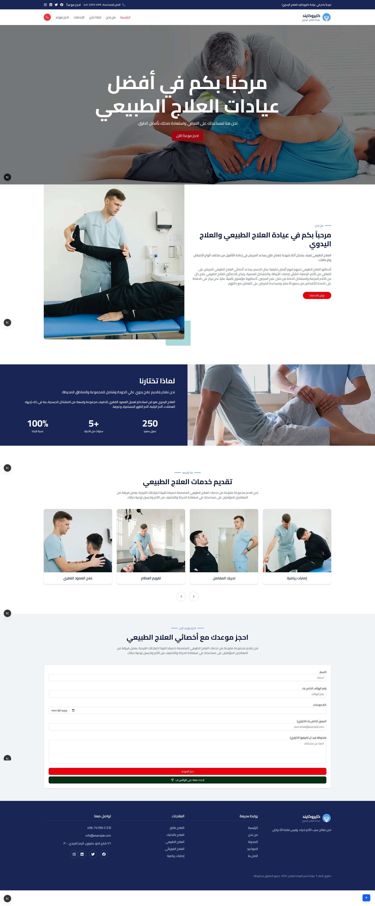

# 🧑‍⚕️ Arabic Physical Therapy Landing Page

This is a responsive and modern landing page website for a physical therapy clinic, fully designed in Arabic with right-to-left (RTL) layout support. Built using **Next.js 15**, **Tailwind CSS**, and **ShadCN UI**, the website is optimized for performance, accessibility, and user experience.

## 📸 Screenshot


> Add your screenshot image and rename it `screenshot.png` in the root of your repo or update the path above.

---

## ✨ Features

- 🌐 RTL Arabic layout
- 🎨 Modern and clean UI design with [ShadCN UI](https://ui.shadcn.com/)
- 📱 Fully responsive (mobile, tablet, desktop)
- 📩 Contact form using **Nodemailer** for email delivery
- ⚡ Built with Next.js App Router (v15)
- 🔍 SEO friendly and fast

---

## 🛠️ Tech Stack

- **Framework:** [Next.js 15](https://nextjs.org/)
- **Styling:** [Tailwind CSS](https://tailwindcss.com/)
- **Components:** [ShadCN UI](https://ui.shadcn.com/)
- **Email:** [Nodemailer](https://nodemailer.com/)

---

## 📂 Project Structure (Simplified)

```
app/
  └── api/
      └── sendMail/route.js    # Contact form backend logic
  └── page.js                  # Main landing page
  └── layout.js                # Global layout wrapper

components/
  └── contact-form.jsx           # Contact form component
  └── header.jsx                 # Hero section, etc.
  └── footer.jsx                 # Footer.
  └── about-us.jsx               # About Us Section.
  └── services.jsx               # Services Section.
  └── navbar.jsx                 # Navbar Component.
  └── topbar.jsx                 # TopBar Component.
  └── to-up-button.jsx           # To Up Button Component.

public/
  └── images/                  # Folder contains project images.
  └── screenshot.png           # Screenshot image (add manually)

data/
  └── navbar-data.js              # Data for navbar
```

---

## 📦 Setup Instructions

1. **Clone the repository:**

   ```bash
   git clone https://github.com/Mo-Ibra/physical-therapy
   cd physical-therapy
   ```

2. **Install dependencies:**

   ```bash
   npm install
   ```

3. **Add environment variables for Nodemailer:**

   Create a `.env.local` file:

   ```env
   GMAIL_USER=your@email.com
   GMAIL_PASS=yourpassword
   ```

4. **Run the development server:**

   ```bash
   npm run dev
   ```

5. Open [http://localhost:3000](http://localhost:3000) in your browser.

---

## 📧 Contact

If you'd like to contribute, open issues or pull requests are welcome!

---

## 📝 License

This project is licensed under the [MIT License](LICENSE).